# Sequence Diagram BrewLite (vẽ ngược từ code)

Tất cả sơ đồ viết bằng Mermaid, bám theo code NestJS + Prisma đã cung cấp.
Cách render: dán từng khối vào https://mermaid.live hoặc dùng Mermaid trong draw.io / VS Code.

| FR | Chức năng | Phạm vi |
| :--- | :--- | :--- |
| FR-01 | Danh mục đồ uống | Sơ đồ 1 |
| FR-02 | Chi tiết sản phẩm | Sơ đồ 2 |
| FR-03 | Giỏ hàng LocalStorage | Chỉ chạy ở client, không có sơ đồ backend (chưa có code frontend) |
| FR-04 | Đăng ký, đăng nhập | Sơ đồ 3, 4, 5 |
| FR-05 | Tạo đơn hàng | Sơ đồ 6 |
| FR-06 | Thanh toán | Sơ đồ 7 |
| FR-07 | Lịch sử và chi tiết đơn | Sơ đồ 8, 9 |
| FR-08 | Trạng thái đơn | Sơ đồ 10 (state), 11, 12 |
| FR-09 | Mã giảm giá | Sơ đồ 13, 14 |
| FR-10 | Tích điểm | Sơ đồ 15, 16 |
| FR-11 | Quản lý món | Chỉ có phần cập nhật tồn kho nguyên liệu (Sơ đồ 17) |
| FR-12, FR-13 | Won't | Không triển khai |
| FR-14 | Health check | Sơ đồ 18, 19 |

---

## 1. FR-01: Hiển thị danh mục đồ uống

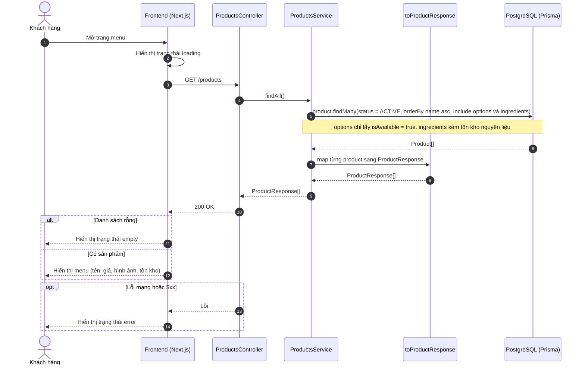
```mermaid
sequenceDiagram
    autonumber
    actor C as Khách hàng
    participant FE as Frontend (Next.js)
    participant PC as ProductsController
    participant PS as ProductsService
    participant PM as toProductResponse
    participant DB as PostgreSQL (Prisma)

    C->>FE: Mở trang menu
    FE->>FE: Hiển thị trạng thái loading
    FE->>PC: GET /products
    PC->>PS: findAll()
    PS->>DB: product.findMany(status = ACTIVE, orderBy name asc, include options và ingredients)
    Note over PS,DB: options chỉ lấy isAvailable = true. ingredients kèm tồn kho nguyên liệu
    DB-->>PS: Product[]
    PS->>PM: map từng product sang ProductResponse
    PM-->>PS: ProductResponse[]
    PS-->>PC: ProductResponse[]
    PC-->>FE: 200 OK
    alt Danh sách rỗng
        FE-->>C: Hiển thị trạng thái empty
    else Có sản phẩm
        FE-->>C: Hiển thị menu (tên, giá, hình ảnh, tồn kho)
    end
    opt Lỗi mạng hoặc 5xx
        PC-->>FE: Lỗi
        FE-->>C: Hiển thị trạng thái error
    end
```

## 2. FR-02: Xem chi tiết sản phẩm và tùy chọn

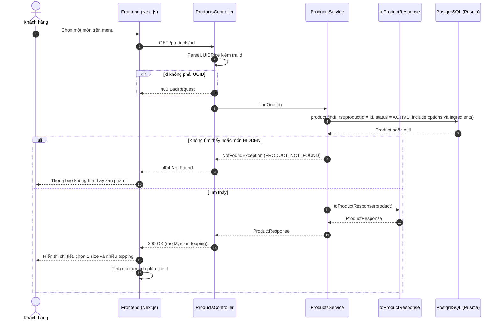
```mermaid
sequenceDiagram
    autonumber
    actor C as Khách hàng
    participant FE as Frontend (Next.js)
    participant PC as ProductsController
    participant PS as ProductsService
    participant PM as toProductResponse
    participant DB as PostgreSQL (Prisma)

    C->>FE: Chọn một món trên menu
    FE->>PC: GET /products/:id
    PC->>PC: ParseUUIDPipe kiểm tra id
    alt id không phải UUID
        PC-->>FE: 400 BadRequest
    end
    PC->>PS: findOne(id)
    PS->>DB: product.findFirst(productId = id, status = ACTIVE, include options và ingredients)
    DB-->>PS: Product hoặc null
    alt Không tìm thấy hoặc món HIDDEN
        PS-->>PC: NotFoundException (PRODUCT_NOT_FOUND)
        PC-->>FE: 404 Not Found
        FE-->>C: Thông báo không tìm thấy sản phẩm
    else Tìm thấy
        PS->>PM: toProductResponse(product)
        PM-->>PS: ProductResponse
        PS-->>PC: ProductResponse
        PC-->>FE: 200 OK (mô tả, size, topping)
        FE-->>C: Hiển thị chi tiết, chọn 1 size và nhiều topping
        FE->>FE: Tính giá tạm tính phía client
    end
```

## 3. FR-04: Đăng ký

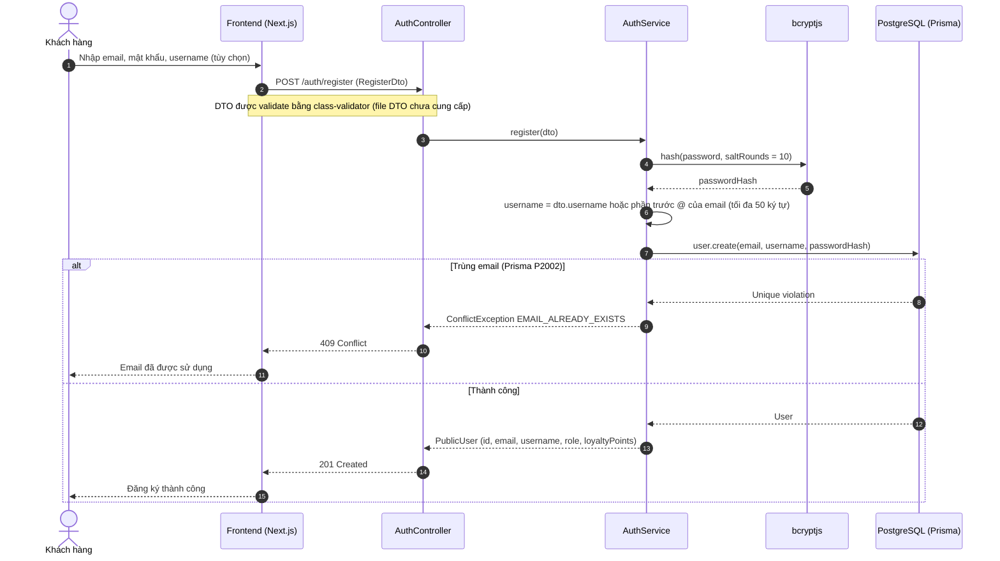
```mermaid
sequenceDiagram
    autonumber
    actor C as Khách hàng
    participant FE as Frontend (Next.js)
    participant AC as AuthController
    participant AS as AuthService
    participant BC as bcryptjs
    participant DB as PostgreSQL (Prisma)

    C->>FE: Nhập email, mật khẩu, username (tùy chọn)
    FE->>AC: POST /auth/register (RegisterDto)
    Note over FE,AC: DTO được validate bằng class-validator (file DTO chưa cung cấp)
    AC->>AS: register(dto)
    AS->>BC: hash(password, saltRounds = 10)
    BC-->>AS: passwordHash
    AS->>AS: username = dto.username hoặc phần trước @ của email (tối đa 50 ký tự)
    AS->>DB: user.create(email, username, passwordHash)
    alt Trùng email (Prisma P2002)
        DB-->>AS: Unique violation
        AS-->>AC: ConflictException EMAIL_ALREADY_EXISTS
        AC-->>FE: 409 Conflict
        FE-->>C: Email đã được sử dụng
    else Thành công
        DB-->>AS: User
        AS-->>AC: PublicUser (id, email, username, role, loyaltyPoints)
        AC-->>FE: 201 Created
        FE-->>C: Đăng ký thành công
    end
```

## 4. FR-04: Đăng nhập

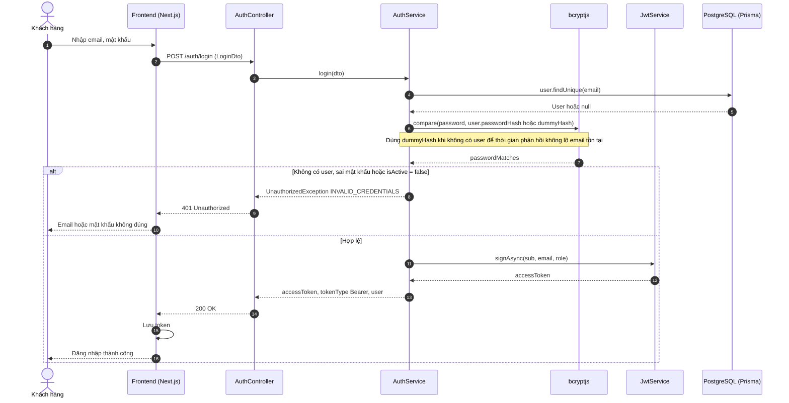
```mermaid
sequenceDiagram
    autonumber
    actor C as Khách hàng
    participant FE as Frontend (Next.js)
    participant AC as AuthController
    participant AS as AuthService
    participant BC as bcryptjs
    participant JW as JwtService
    participant DB as PostgreSQL (Prisma)

    C->>FE: Nhập email, mật khẩu
    FE->>AC: POST /auth/login (LoginDto)
    AC->>AS: login(dto)
    AS->>DB: user.findUnique(email)
    DB-->>AS: User hoặc null
    AS->>BC: compare(password, user.passwordHash hoặc dummyHash)
    Note over AS,BC: Dùng dummyHash khi không có user để thời gian phản hồi không lộ email tồn tại
    BC-->>AS: passwordMatches
    alt Không có user, sai mật khẩu hoặc isActive = false
        AS-->>AC: UnauthorizedException INVALID_CREDENTIALS
        AC-->>FE: 401 Unauthorized
        FE-->>C: Email hoặc mật khẩu không đúng
    else Hợp lệ
        AS->>JW: signAsync(sub, email, role)
        JW-->>AS: accessToken
        AS-->>AC: accessToken, tokenType Bearer, user
        AC-->>FE: 200 OK
        FE->>FE: Lưu token
        FE-->>C: Đăng nhập thành công
    end
```

## 5. FR-04: Lấy thông tin tài khoản (GET /auth/me)

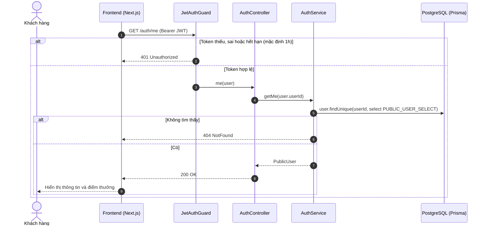
```mermaid
sequenceDiagram
    autonumber
    actor C as Khách hàng
    participant FE as Frontend (Next.js)
    participant G as JwtAuthGuard
    participant AC as AuthController
    participant AS as AuthService
    participant DB as PostgreSQL (Prisma)

    FE->>G: GET /auth/me (Bearer JWT)
    alt Token thiếu, sai hoặc hết hạn (mặc định 1h)
        G-->>FE: 401 Unauthorized
    else Token hợp lệ
        G->>AC: me(user)
        AC->>AS: getMe(user.userId)
        AS->>DB: user.findUnique(userId, select PUBLIC_USER_SELECT)
        alt Không tìm thấy
            AS-->>FE: 404 NotFound
        else Có
            AS-->>AC: PublicUser
            AC-->>FE: 200 OK
            FE-->>C: Hiển thị thông tin và điểm thưởng
        end
    end
```

## 6. FR-05: Tạo đơn hàng

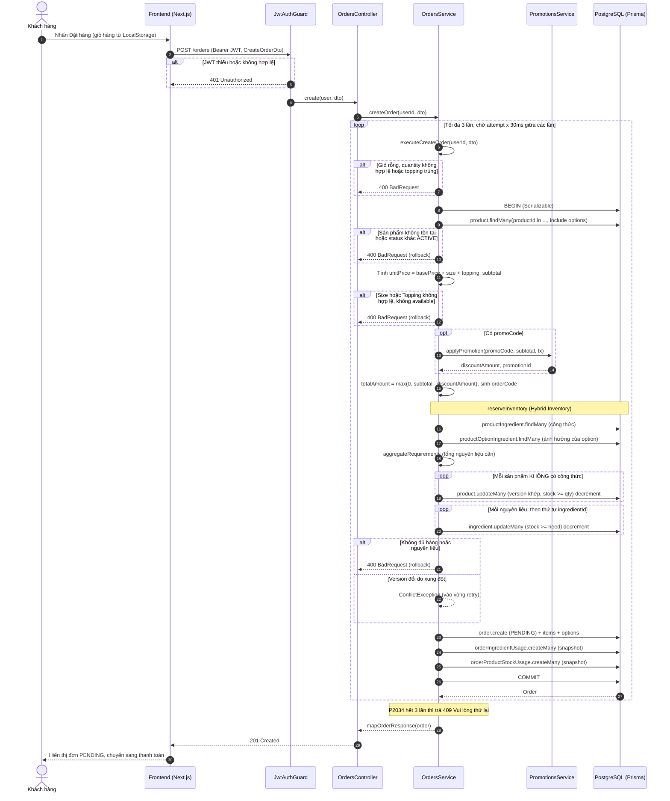
```mermaid
sequenceDiagram
    autonumber
    actor C as Khách hàng
    participant FE as Frontend (Next.js)
    participant G as JwtAuthGuard
    participant OC as OrdersController
    participant OS as OrdersService
    participant PR as PromotionsService
    participant DB as PostgreSQL (Prisma)

    C->>FE: Nhấn Đặt hàng (giỏ hàng từ LocalStorage)
    FE->>G: POST /orders (Bearer JWT, CreateOrderDto)
    alt JWT thiếu hoặc không hợp lệ
        G-->>FE: 401 Unauthorized
    end
    G->>OC: create(user, dto)
    OC->>OS: createOrder(userId, dto)

    loop Tối đa 3 lần, chờ attempt x 30ms giữa các lần
        OS->>OS: executeCreateOrder(userId, dto)
        alt Giỏ rỗng, quantity không hợp lệ hoặc topping trùng
            OS-->>OC: 400 BadRequest
        end
        OS->>DB: BEGIN (Serializable)
        OS->>DB: product.findMany(productId in ..., include options)
        alt Sản phẩm không tồn tại hoặc status khác ACTIVE
            OS-->>OC: 400 BadRequest (rollback)
        end
        OS->>OS: Tính unitPrice = basePrice + size + topping, subtotal
        alt Size hoặc Topping không hợp lệ, không available
            OS-->>OC: 400 BadRequest (rollback)
        end
        opt Có promoCode
            OS->>PR: applyPromotion(promoCode, subtotal, tx)
            PR-->>OS: discountAmount, promotionId
        end
        OS->>OS: totalAmount = max(0, subtotal - discountAmount), sinh orderCode

        Note over OS,DB: reserveInventory (Hybrid Inventory)
        OS->>DB: productIngredient.findMany (công thức)
        OS->>DB: productOptionIngredient.findMany (ảnh hưởng của option)
        OS->>OS: aggregateRequirements (tổng nguyên liệu cần)
        loop Mỗi sản phẩm KHÔNG có công thức
            OS->>DB: product.updateMany (version khớp, stock >= qty) decrement
        end
        loop Mỗi nguyên liệu, theo thứ tự ingredientId
            OS->>DB: ingredient.updateMany (stock >= need) decrement
        end
        alt Không đủ hàng hoặc nguyên liệu
            OS-->>OC: 400 BadRequest (rollback)
        else Version đổi do xung đột
            OS-->>OS: ConflictException (vào vòng retry)
        end

        OS->>DB: order.create (PENDING) + items + options
        OS->>DB: orderIngredientUsage.createMany (snapshot)
        OS->>DB: orderProductStockUsage.createMany (snapshot)
        OS->>DB: COMMIT
        DB-->>OS: Order
    end
    Note over OS: P2034 hết 3 lần thì trả 409 Vui lòng thử lại
    OS-->>OC: mapOrderResponse(order)
    OC-->>FE: 201 Created
    FE-->>C: Hiển thị đơn PENDING, chuyển sang thanh toán
```

## 7. FR-06: Thanh toán

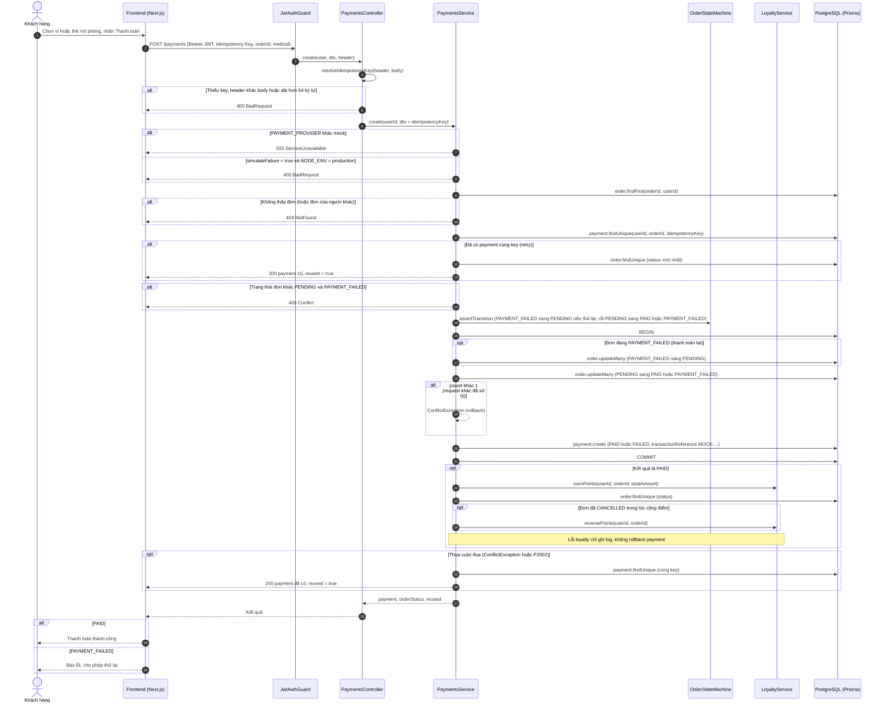
```mermaid
sequenceDiagram
    autonumber
    actor C as Khách hàng
    participant FE as Frontend (Next.js)
    participant G as JwtAuthGuard
    participant PC as PaymentsController
    participant PS as PaymentsService
    participant SM as OrderStateMachine
    participant LS as LoyaltyService
    participant DB as PostgreSQL (Prisma)

    C->>FE: Chọn ví hoặc thẻ mô phỏng, nhấn Thanh toán
    FE->>G: POST /payments (Bearer JWT, Idempotency-Key, orderId, method)
    G->>PC: create(user, dto, header)
    PC->>PC: resolveIdempotencyKey(header, body)
    alt Thiếu key, header khác body hoặc dài hơn 64 ký tự
        PC-->>FE: 400 BadRequest
    end
    PC->>PS: create(userId, dto + idempotencyKey)

    alt PAYMENT_PROVIDER khác mock
        PS-->>FE: 503 ServiceUnavailable
    else simulateFailure = true và NODE_ENV = production
        PS-->>FE: 400 BadRequest
    end

    PS->>DB: order.findFirst(orderId, userId)
    alt Không thấy đơn (hoặc đơn của người khác)
        PS-->>FE: 404 NotFound
    end

    PS->>DB: payment.findUnique(userId, orderId, idempotencyKey)
    alt Đã có payment cùng key (retry)
        PS->>DB: order.findUnique (status mới nhất)
        PS-->>FE: 200 payment cũ, reused = true
    end

    alt Trạng thái đơn khác PENDING và PAYMENT_FAILED
        PS-->>FE: 409 Conflict
    end
    PS->>SM: assertTransition (PAYMENT_FAILED sang PENDING nếu thử lại, rồi PENDING sang PAID hoặc PAYMENT_FAILED)

    PS->>DB: BEGIN
    opt Đơn đang PAYMENT_FAILED (thanh toán lại)
        PS->>DB: order.updateMany (PAYMENT_FAILED sang PENDING)
    end
    PS->>DB: order.updateMany (PENDING sang PAID hoặc PAYMENT_FAILED)
    alt count khác 1 (request khác đã xử lý)
        PS-->>PS: ConflictException (rollback)
    end
    PS->>DB: payment.create (PAID hoặc FAILED, transactionReference MOCK-...)
    PS->>DB: COMMIT

    opt Kết quả là PAID
        PS->>LS: earnPoints(userId, orderId, totalAmount)
        PS->>DB: order.findUnique (status)
        opt Đơn đã CANCELLED trong lúc cộng điểm
            PS->>LS: reversePoints(userId, orderId)
        end
        Note over PS,LS: Lỗi loyalty chỉ ghi log, không rollback payment
    end

    opt Thua cuộc đua (ConflictException hoặc P2002)
        PS->>DB: payment.findUnique (cùng key)
        PS-->>FE: 200 payment đã có, reused = true
    end
    PS-->>PC: payment, orderStatus, reused
    PC-->>FE: Kết quả
    alt PAID
        FE-->>C: Thanh toán thành công
    else PAYMENT_FAILED
        FE-->>C: Báo lỗi, cho phép thử lại
    end
```

## 8. FR-07: Danh sách đơn hàng của tôi

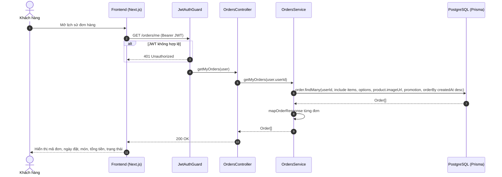
```mermaid
sequenceDiagram
    autonumber
    actor C as Khách hàng
    participant FE as Frontend (Next.js)
    participant G as JwtAuthGuard
    participant OC as OrdersController
    participant OS as OrdersService
    participant DB as PostgreSQL (Prisma)

    C->>FE: Mở lịch sử đơn hàng
    FE->>G: GET /orders/me (Bearer JWT)
    alt JWT không hợp lệ
        G-->>FE: 401 Unauthorized
    end
    G->>OC: getMyOrders(user)
    OC->>OS: getMyOrders(user.userId)
    OS->>DB: order.findMany(userId, include items, options, product.imageUrl, promotion, orderBy createdAt desc)
    DB-->>OS: Order[]
    OS->>OS: mapOrderResponse từng đơn
    OS-->>OC: Order[]
    OC-->>FE: 200 OK
    FE-->>C: Hiển thị mã đơn, ngày đặt, món, tổng tiền, trạng thái
```

## 9. FR-07: Chi tiết một đơn hàng

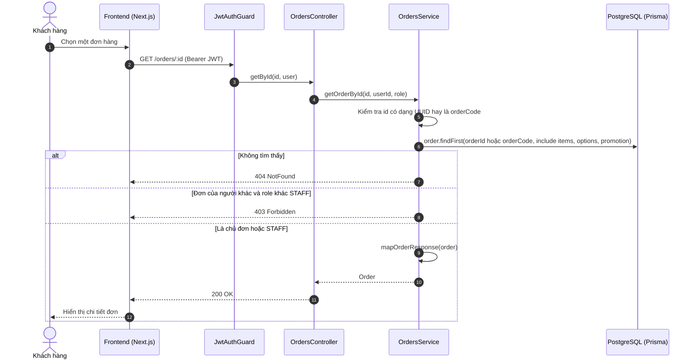
```mermaid
sequenceDiagram
    autonumber
    actor C as Khách hàng
    participant FE as Frontend (Next.js)
    participant G as JwtAuthGuard
    participant OC as OrdersController
    participant OS as OrdersService
    participant DB as PostgreSQL (Prisma)

    C->>FE: Chọn một đơn hàng
    FE->>G: GET /orders/:id (Bearer JWT)
    G->>OC: getById(id, user)
    OC->>OS: getOrderById(id, userId, role)
    OS->>OS: Kiểm tra id có dạng UUID hay là orderCode
    OS->>DB: order.findFirst(orderId hoặc orderCode, include items, options, promotion)
    alt Không tìm thấy
        OS-->>FE: 404 NotFound
    else Đơn của người khác và role khác STAFF
        OS-->>FE: 403 Forbidden
    else Là chủ đơn hoặc STAFF
        OS->>OS: mapOrderResponse(order)
        OS-->>OC: Order
        OC-->>FE: 200 OK
        FE-->>C: Hiển thị chi tiết đơn
    end
```

## 10. FR-08: Sơ đồ trạng thái đơn hàng (theo OrderStateMachine)

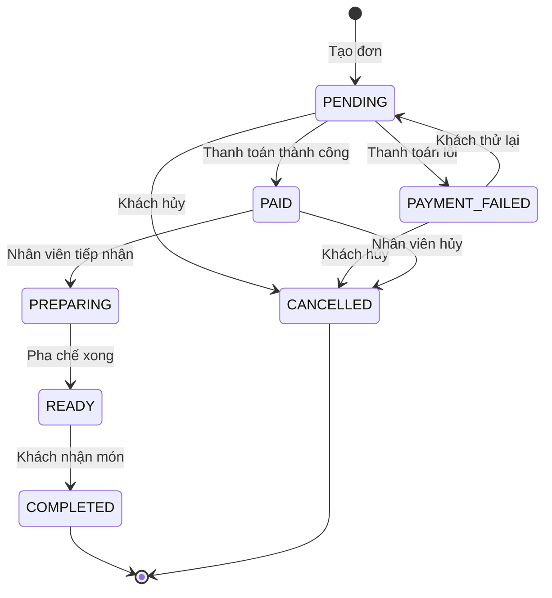
```mermaid
stateDiagram-v2
    [*] --> PENDING: Tạo đơn
    PENDING --> PAID: Thanh toán thành công
    PENDING --> PAYMENT_FAILED: Thanh toán lỗi
    PAYMENT_FAILED --> PENDING: Khách thử lại
    PENDING --> CANCELLED: Khách hủy
    PAYMENT_FAILED --> CANCELLED: Khách hủy
    PAID --> CANCELLED: Nhân viên hủy
    PAID --> PREPARING: Nhân viên tiếp nhận
    PREPARING --> READY: Pha chế xong
    READY --> COMPLETED: Khách nhận món
    COMPLETED --> [*]
    CANCELLED --> [*]
```

## 11. FR-08: Hủy đơn hàng

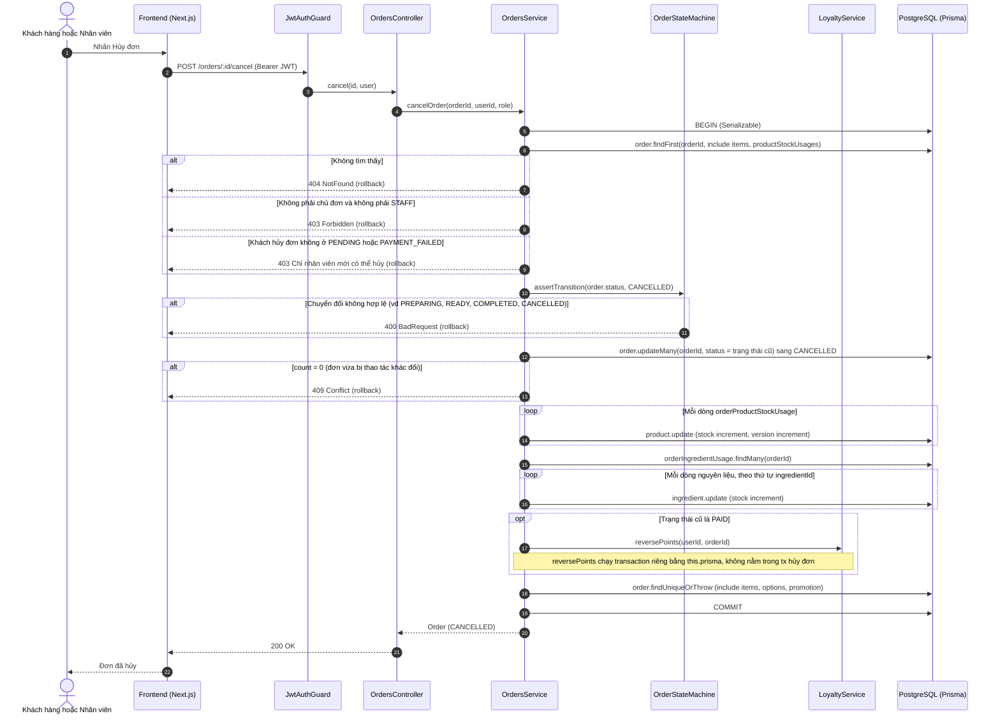
```mermaid
sequenceDiagram
    autonumber
    actor U as Khách hàng hoặc Nhân viên
    participant FE as Frontend (Next.js)
    participant G as JwtAuthGuard
    participant OC as OrdersController
    participant OS as OrdersService
    participant SM as OrderStateMachine
    participant LS as LoyaltyService
    participant DB as PostgreSQL (Prisma)

    U->>FE: Nhấn Hủy đơn
    FE->>G: POST /orders/:id/cancel (Bearer JWT)
    G->>OC: cancel(id, user)
    OC->>OS: cancelOrder(orderId, userId, role)
    OS->>DB: BEGIN (Serializable)
    OS->>DB: order.findFirst(orderId, include items, productStockUsages)
    alt Không tìm thấy
        OS-->>FE: 404 NotFound (rollback)
    else Không phải chủ đơn và không phải STAFF
        OS-->>FE: 403 Forbidden (rollback)
    else Khách hủy đơn không ở PENDING hoặc PAYMENT_FAILED
        OS-->>FE: 403 Chỉ nhân viên mới có thể hủy (rollback)
    end
    OS->>SM: assertTransition(order.status, CANCELLED)
    alt Chuyển đổi không hợp lệ (vd PREPARING, READY, COMPLETED, CANCELLED)
        SM-->>FE: 400 BadRequest (rollback)
    end
    OS->>DB: order.updateMany(orderId, status = trạng thái cũ) sang CANCELLED
    alt count = 0 (đơn vừa bị thao tác khác đổi)
        OS-->>FE: 409 Conflict (rollback)
    end
    loop Mỗi dòng orderProductStockUsage
        OS->>DB: product.update (stock increment, version increment)
    end
    OS->>DB: orderIngredientUsage.findMany(orderId)
    loop Mỗi dòng nguyên liệu, theo thứ tự ingredientId
        OS->>DB: ingredient.update (stock increment)
    end
    opt Trạng thái cũ là PAID
        OS->>LS: reversePoints(userId, orderId)
        Note over OS,LS: reversePoints chạy transaction riêng bằng this.prisma, không nằm trong tx hủy đơn
    end
    OS->>DB: order.findUniqueOrThrow (include items, options, promotion)
    OS->>DB: COMMIT
    OS-->>OC: Order (CANCELLED)
    OC-->>FE: 200 OK
    FE-->>U: Đơn đã hủy
```

## 12. FR-08: Nhân viên cập nhật trạng thái

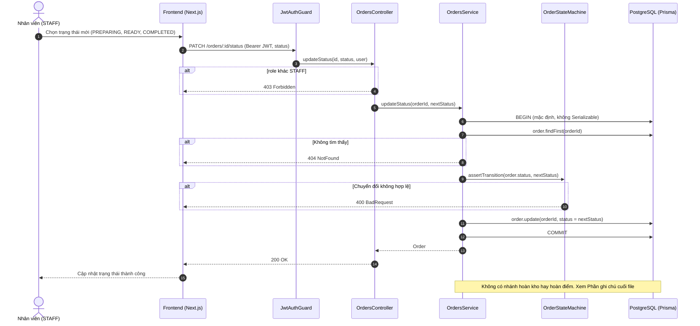
```mermaid
sequenceDiagram
    autonumber
    actor S as Nhân viên (STAFF)
    participant FE as Frontend (Next.js)
    participant G as JwtAuthGuard
    participant OC as OrdersController
    participant OS as OrdersService
    participant SM as OrderStateMachine
    participant DB as PostgreSQL (Prisma)

    S->>FE: Chọn trạng thái mới (PREPARING, READY, COMPLETED)
    FE->>G: PATCH /orders/:id/status (Bearer JWT, status)
    G->>OC: updateStatus(id, status, user)
    alt role khác STAFF
        OC-->>FE: 403 Forbidden
    end
    OC->>OS: updateStatus(orderId, nextStatus)
    OS->>DB: BEGIN (mặc định, không Serializable)
    OS->>DB: order.findFirst(orderId)
    alt Không tìm thấy
        OS-->>FE: 404 NotFound
    end
    OS->>SM: assertTransition(order.status, nextStatus)
    alt Chuyển đổi không hợp lệ
        SM-->>FE: 400 BadRequest
    end
    OS->>DB: order.update(orderId, status = nextStatus)
    OS->>DB: COMMIT
    OS-->>OC: Order
    OC-->>FE: 200 OK
    FE-->>S: Cập nhật trạng thái thành công
    Note over OS,DB: Không có nhánh hoàn kho hay hoàn điểm. Xem Phần ghi chú cuối file
```

## 13. FR-09: Xem trước mã giảm giá

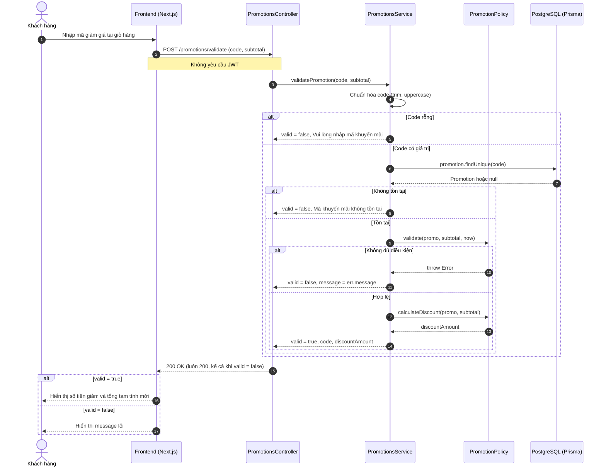
```mermaid
sequenceDiagram
    autonumber
    actor C as Khách hàng
    participant FE as Frontend (Next.js)
    participant PC as PromotionsController
    participant PS as PromotionsService
    participant PP as PromotionPolicy
    participant DB as PostgreSQL (Prisma)

    C->>FE: Nhập mã giảm giá tại giỏ hàng
    FE->>PC: POST /promotions/validate (code, subtotal)
    Note over FE,PC: Không yêu cầu JWT
    PC->>PS: validatePromotion(code, subtotal)
    PS->>PS: Chuẩn hóa code (trim, uppercase)
    alt Code rỗng
        PS-->>PC: valid = false, Vui lòng nhập mã khuyến mãi
    else Code có giá trị
        PS->>DB: promotion.findUnique(code)
        DB-->>PS: Promotion hoặc null
        alt Không tồn tại
            PS-->>PC: valid = false, Mã khuyến mãi không tồn tại
        else Tồn tại
            PS->>PP: validate(promo, subtotal, now)
            alt Không đủ điều kiện
                PP-->>PS: throw Error
                PS-->>PC: valid = false, message = err.message
            else Hợp lệ
                PS->>PP: calculateDiscount(promo, subtotal)
                PP-->>PS: discountAmount
                PS-->>PC: valid = true, code, discountAmount
            end
        end
    end
    PC-->>FE: 200 OK (luôn 200, kể cả khi valid = false)
    alt valid = true
        FE-->>C: Hiển thị số tiền giảm và tổng tạm tính mới
    else valid = false
        FE-->>C: Hiển thị message lỗi
    end
```

## 14. FR-09: Áp dụng mã khi tạo đơn (bước 4 của sơ đồ 6)

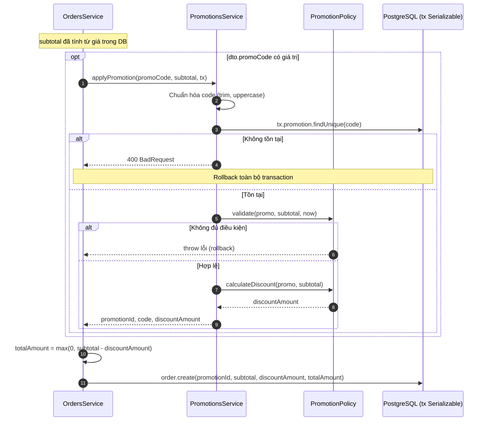
```mermaid
sequenceDiagram
    autonumber
    participant OS as OrdersService
    participant PS as PromotionsService
    participant PP as PromotionPolicy
    participant DB as PostgreSQL (tx Serializable)

    Note over OS: subtotal đã tính từ giá trong DB
    opt dto.promoCode có giá trị
        OS->>PS: applyPromotion(promoCode, subtotal, tx)
        PS->>PS: Chuẩn hóa code (trim, uppercase)
        PS->>DB: tx.promotion.findUnique(code)
        alt Không tồn tại
            PS-->>OS: 400 BadRequest
            Note over OS,DB: Rollback toàn bộ transaction
        else Tồn tại
            PS->>PP: validate(promo, subtotal, now)
            alt Không đủ điều kiện
                PP-->>OS: throw lỗi (rollback)
            else Hợp lệ
                PS->>PP: calculateDiscount(promo, subtotal)
                PP-->>PS: discountAmount
                PS-->>OS: promotionId, code, discountAmount
            end
        end
    end
    OS->>OS: totalAmount = max(0, subtotal - discountAmount)
    OS->>DB: order.create(promotionId, subtotal, discountAmount, totalAmount)
```

## 15. FR-10: Tích điểm sau thanh toán thành công

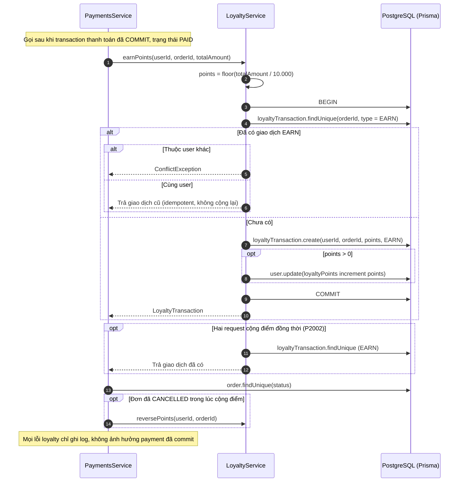
```mermaid
sequenceDiagram
    autonumber
    participant PS as PaymentsService
    participant LS as LoyaltyService
    participant DB as PostgreSQL (Prisma)

    Note over PS: Gọi sau khi transaction thanh toán đã COMMIT, trạng thái PAID
    PS->>LS: earnPoints(userId, orderId, totalAmount)
    LS->>LS: points = floor(totalAmount / 10.000)
    LS->>DB: BEGIN
    LS->>DB: loyaltyTransaction.findUnique(orderId, type = EARN)
    alt Đã có giao dịch EARN
        alt Thuộc user khác
            LS-->>PS: ConflictException
        else Cùng user
            LS-->>PS: Trả giao dịch cũ (idempotent, không cộng lại)
        end
    else Chưa có
        LS->>DB: loyaltyTransaction.create(userId, orderId, points, EARN)
        opt points > 0
            LS->>DB: user.update(loyaltyPoints increment points)
        end
        LS->>DB: COMMIT
        LS-->>PS: LoyaltyTransaction
    end
    opt Hai request cộng điểm đồng thời (P2002)
        LS->>DB: loyaltyTransaction.findUnique (EARN)
        LS-->>PS: Trả giao dịch đã có
    end
    PS->>DB: order.findUnique(status)
    opt Đơn đã CANCELLED trong lúc cộng điểm
        PS->>LS: reversePoints(userId, orderId)
    end
    Note over PS: Mọi lỗi loyalty chỉ ghi log, không ảnh hưởng payment đã commit
```

## 16. FR-10: Hoàn điểm khi đơn PAID bị hủy

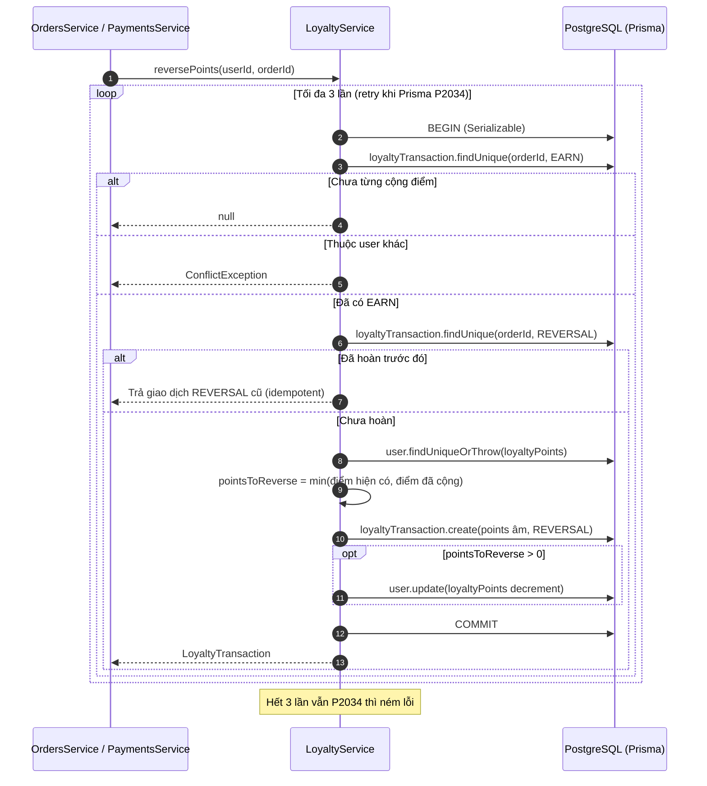
```mermaid
sequenceDiagram
    autonumber
    participant OS as OrdersService / PaymentsService
    participant LS as LoyaltyService
    participant DB as PostgreSQL (Prisma)

    OS->>LS: reversePoints(userId, orderId)
    loop Tối đa 3 lần (retry khi Prisma P2034)
        LS->>DB: BEGIN (Serializable)
        LS->>DB: loyaltyTransaction.findUnique(orderId, EARN)
        alt Chưa từng cộng điểm
            LS-->>OS: null
        else Thuộc user khác
            LS-->>OS: ConflictException
        else Đã có EARN
            LS->>DB: loyaltyTransaction.findUnique(orderId, REVERSAL)
            alt Đã hoàn trước đó
                LS-->>OS: Trả giao dịch REVERSAL cũ (idempotent)
            else Chưa hoàn
                LS->>DB: user.findUniqueOrThrow(loyaltyPoints)
                LS->>LS: pointsToReverse = min(điểm hiện có, điểm đã cộng)
                LS->>DB: loyaltyTransaction.create(points âm, REVERSAL)
                opt pointsToReverse > 0
                    LS->>DB: user.update(loyaltyPoints decrement)
                end
                LS->>DB: COMMIT
                LS-->>OS: LoyaltyTransaction
            end
        end
    end
    Note over LS: Hết 3 lần vẫn P2034 thì ném lỗi
```

## 17. FR-11 (một phần): Nhân viên cập nhật tồn kho nguyên liệu

Chưa có API thêm hoặc sửa sản phẩm (ProductsController chỉ có GET). Chỉ có phần tồn kho nguyên liệu dưới đây.

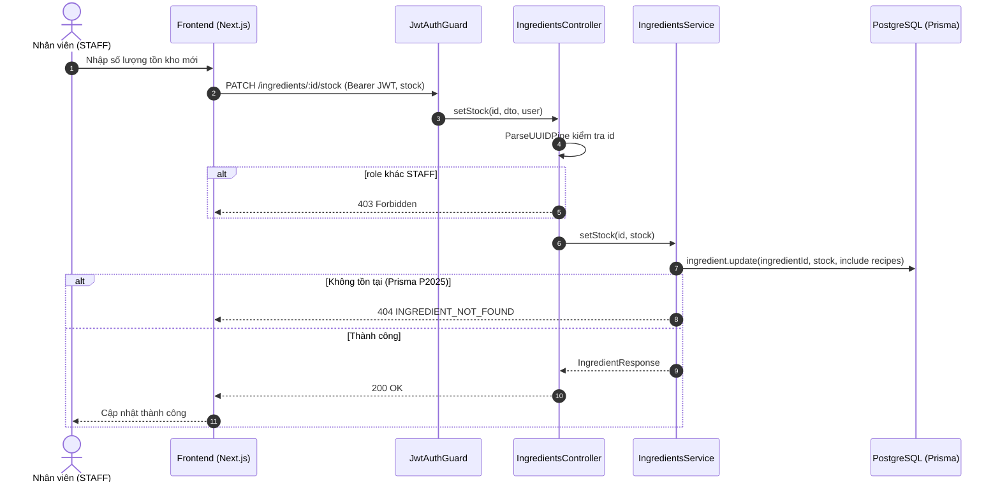
```mermaid
sequenceDiagram
    autonumber
    actor S as Nhân viên (STAFF)
    participant FE as Frontend (Next.js)
    participant G as JwtAuthGuard
    participant IC as IngredientsController
    participant IS as IngredientsService
    participant DB as PostgreSQL (Prisma)

    S->>FE: Nhập số lượng tồn kho mới
    FE->>G: PATCH /ingredients/:id/stock (Bearer JWT, stock)
    G->>IC: setStock(id, dto, user)
    IC->>IC: ParseUUIDPipe kiểm tra id
    alt role khác STAFF
        IC-->>FE: 403 Forbidden
    end
    IC->>IS: setStock(id, stock)
    IS->>DB: ingredient.update(ingredientId, stock, include recipes)
    alt Không tồn tại (Prisma P2025)
        IS-->>FE: 404 INGREDIENT_NOT_FOUND
    else Thành công
        IS-->>IC: IngredientResponse
        IC-->>FE: 200 OK
        FE-->>S: Cập nhật thành công
    end
```

## 18. FR-14: Liveness (GET /health)

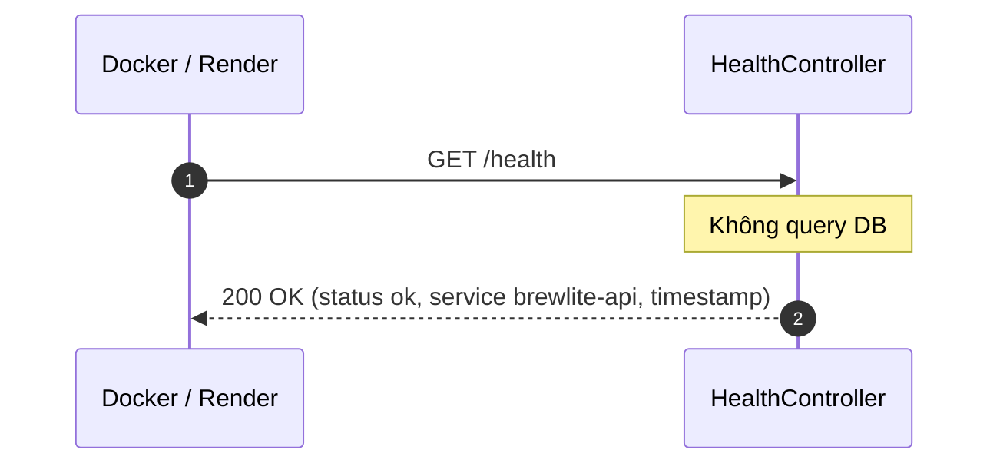
```mermaid
sequenceDiagram
    autonumber
    participant D as Docker / Render
    participant HC as HealthController

    D->>HC: GET /health
    Note over HC: Không query DB
    HC-->>D: 200 OK (status ok, service brewlite-api, timestamp)
```

## 19. FR-14: Readiness (GET /health/ready)

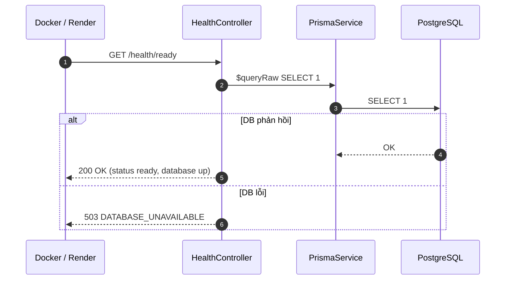
```mermaid
sequenceDiagram
    autonumber
    participant D as Docker / Render
    participant HC as HealthController
    participant PR as PrismaService
    participant DB as PostgreSQL

    D->>HC: GET /health/ready
    HC->>PR: $queryRaw SELECT 1
    PR->>DB: SELECT 1
    alt DB phản hồi
        DB-->>PR: OK
        HC-->>D: 200 OK (status ready, database up)
    else DB lỗi
        HC-->>D: 503 DATABASE_UNAVAILABLE
    end
```

---

## Ghi chú đối chiếu code với SRS

1. **`PATCH /orders/:id/status` có thể bỏ qua luồng thanh toán và hoàn kho.** `OrderStateMachine` cho phép PENDING sang PAID, PENDING/PAYMENT_FAILED/PAID sang CANCELLED. `updateStatus` chỉ kiểm tra transition rồi ghi thẳng trạng thái, nên STAFF gọi endpoint này có thể:
   - đặt `CANCELLED` mà không hoàn tồn kho, nguyên liệu và điểm thưởng (khác với `cancelOrder`);
   - đặt `PAID` cho đơn PENDING mà không có bản ghi payment và không tích điểm;
   - đặt `PENDING` cho đơn PAYMENT_FAILED mà không qua thanh toán.
   Khuyến nghị: giới hạn `updateStatus` chỉ cho PREPARING, READY, COMPLETED, hoặc dùng `where: { status: trạng thái cũ }` kèm chặn các trạng thái còn lại.
2. **`updateStatus` không khóa theo trạng thái cũ** (khác `cancelOrder` dùng `updateMany` có điều kiện). Hai request đồng thời có thể ghi đè nhau.
3. **Hủy đơn quá hạn chưa thanh toán (FR-08):** không có cron hay scheduler trong code đã cung cấp.
4. **`reversePoints` trong `cancelOrder` dùng `this.prisma`, không phải `tx`.** Nếu transaction hủy đơn rollback sau đó, điểm vẫn có thể đã bị thu hồi.
5. **Nhân viên xem được mọi đơn** (`getOrderById`). SRS FR-07 chỉ nói người dùng không xem được đơn của người khác. Đây là mở rộng hợp lý cho STAFF nên cần ghi vào SRS.
6. **Comment lệch code:** `orders.controller` ghi hủy "đang PENDING", nhưng code cho khách hủy cả PAYMENT_FAILED. Đúng với SRS, chỉ comment cũ.
7. **FR-14:** code có `/health` và `/health/ready`, SRS chỉ nhắc `/health`. Phần migration và seed chưa có file nên chưa vẽ.
8. **FR-05:** thiếu hàng trả 400, chỉ xung đột đồng thời mới trả 409.
9. **FR-09:** `/promotions/validate` luôn trả 200 (`valid` true hoặc false), còn `applyPromotion` trong `createOrder` ném 400. Chưa thấy cơ chế đếm lượt dùng mã. Chi tiết `validate` và `calculateDiscount` cần file `promotion-policy.ts`.
10. **FR-11:** chưa có API thêm, sửa sản phẩm. Chỉ có cập nhật tồn kho nguyên liệu.
11. **Chưa có code để xác nhận:** `jwt-auth.guard.ts`, `jwt.strategy.ts`, các DTO, `product-response.ts`, `ingredient-policy.ts`, code frontend (giỏ hàng FR-03) và file seed. Các bước liên quan đã được vẽ ở mức chung.
